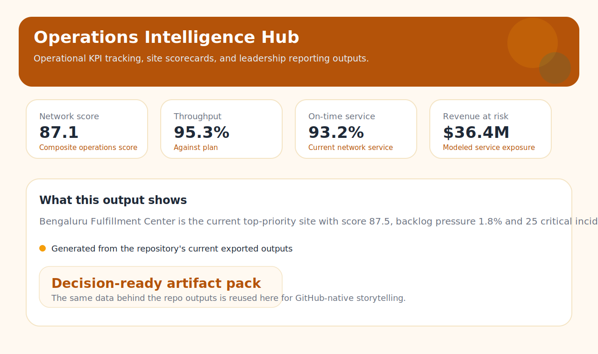
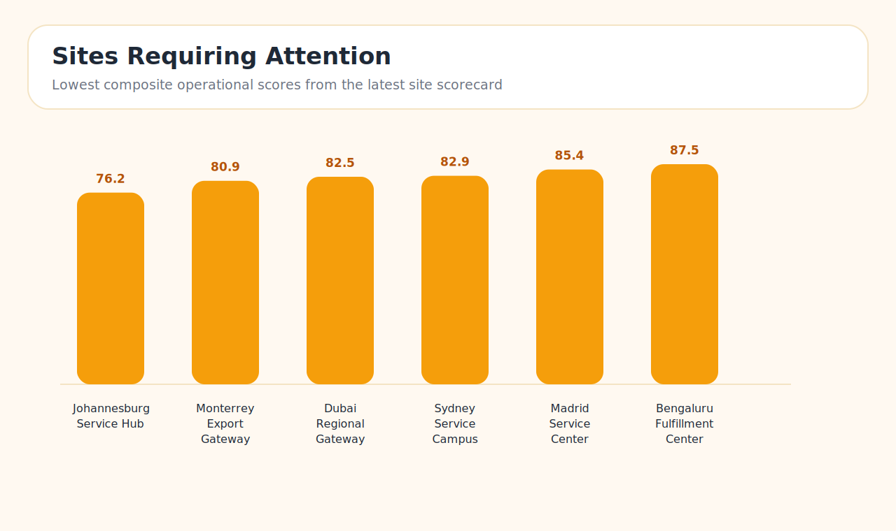

# Operations Intelligence Hub

Operations analytics project focused on KPI design, reporting engineering, and Power BI delivery. It models a multi-region fulfillment network, generates large synthetic datasets, produces site scorecards and executive summaries, and packages the semantic assets needed to build a polished Power BI command center.

## Overview

- Frames the problem as an operations planning and reporting workflow rather than a dashboard-only exercise
- Includes telemetry for throughput, service levels, labor efficiency, backlog pressure, and quality risk
- Produces site scorecards, risk alerts, KPI snapshots, and executive HTML briefings
- Ships with Power BI semantic guidance, DAX measures, theming, and report blueprints

## Visual Outputs





## Project Layout

- `src/operations_intelligence_hub/` contains the package code and CLI
- `data/raw/` contains generated site, operations, order, and incident datasets
- `data/processed/` contains curated scorecards and alert outputs
- `artifacts/` contains KPI snapshots, root-cause summaries, and HTML summary outputs
- `powerbi/` contains DAX, semantic model metadata, a theme, and dashboard build guidance
- `docs/` contains the architecture and KPI design notes

## Quick Start

```bash
python -m venv .venv
source .venv/bin/activate
python -m pip install -e .
python -m operations_intelligence_hub.cli run-all --days 365 --sites 12 --orders-per-site-day 28
```

## What Gets Generated

The default run creates a full reporting pack:

- `data/raw/site_dimension.csv`
- `data/raw/operations_performance_daily.csv`
- `data/raw/order_service_levels.csv`
- `data/raw/quality_incidents.csv`
- `data/processed/site_performance_scorecard.csv`
- `data/processed/network_alerts.csv`
- `artifacts/executive_kpi_snapshot.json`
- `artifacts/root_cause_summary.csv`
- `artifacts/executive_brief.md`
- `artifacts/executive_summary.html`
- `powerbi/measures.dax`
- `powerbi/semantic_model.json`
- `powerbi/dashboard_blueprint.md`
- `powerbi/theme.json`
- `powerbi/dashboard_preview.html`

## Business Questions It Answers

- Which sites are falling behind plan even when labor spend increases?
- Where is service-level risk concentrated by region, shift pattern, or workstream?
- Which root causes create the most value leakage across delayed orders and operational incidents?
- Which sites should leadership prioritize for process stabilization, automation, or staffing interventions?

## Power BI Delivery

The `powerbi/` folder is designed as a serious build kit rather than a placeholder:

- `semantic_model.json` documents tables, relationships, and refresh guidance
- `measures.dax` provides reusable KPI calculations
- `theme.json` defines a cohesive visual system
- `dashboard_blueprint.md` maps the report pages and narrative flow
- `dashboard_preview.html` gives a polished static preview of the intended reporting experience

## Recommended Extensions

- Publish curated extracts to a warehouse and wire refresh orchestration through GitHub Actions or Airflow
- Expose KPI services through a lightweight API for near-real-time operational review
- Add anomaly detection and forecast layers for proactive staffing and capacity planning
- Convert the static preview into a deployed BI or internal portal experience
